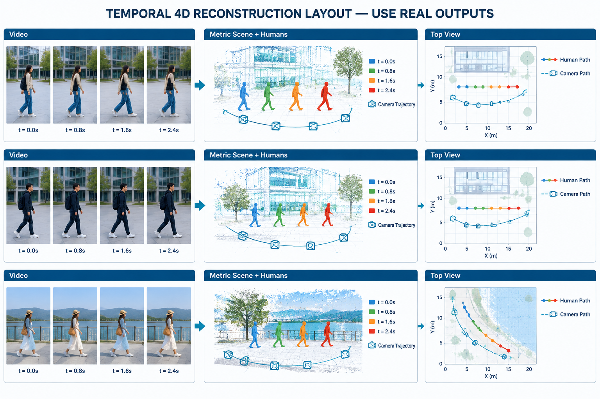
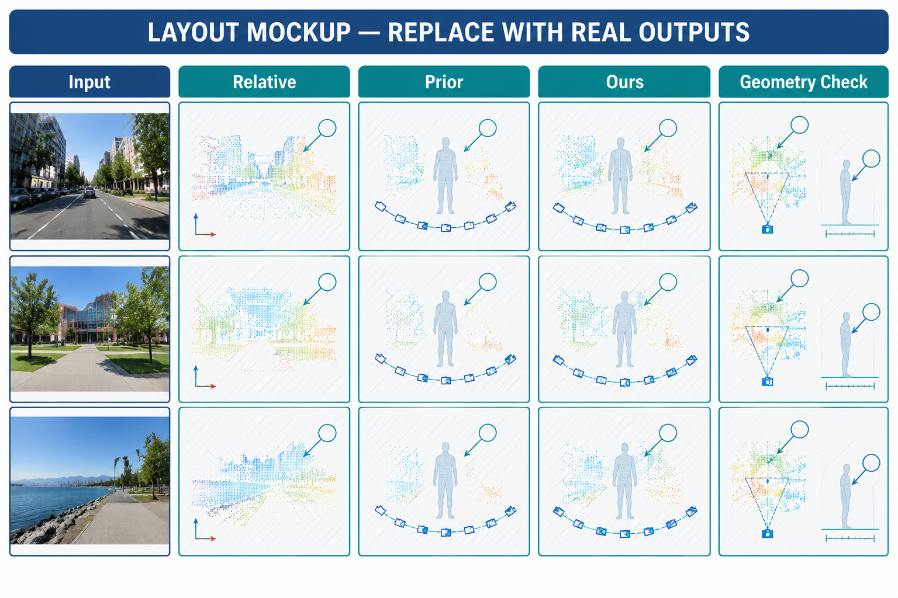
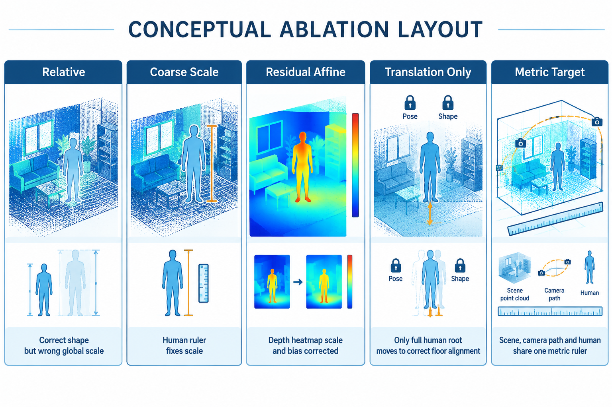
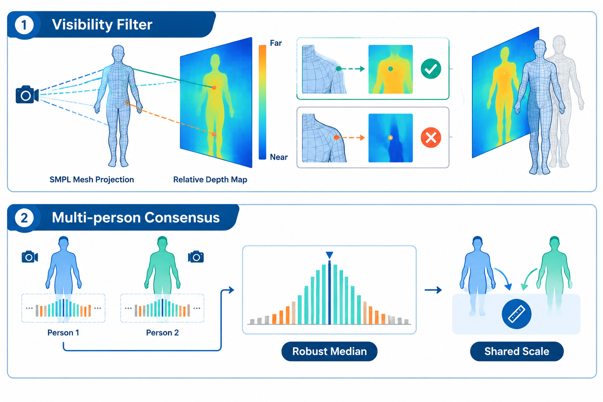
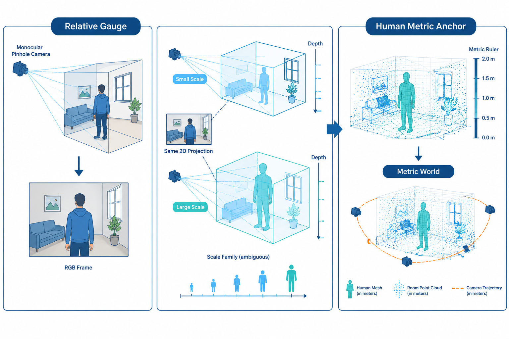
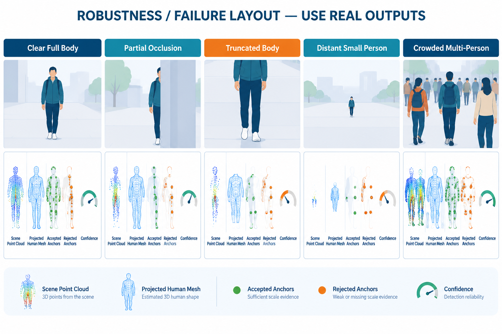

# ICLR v0.2 视觉增强与配图清单

## 1. 当前论文的视觉问题

当前 v0.1 已经具有四张图：核心观察 teaser、方法总览、尺度/TRSTR 细节图和通用三维重建曲线。数量本身不算极少，真正的问题是图的功能过于集中：前三张都在解释“方法是什么”，只有最后一张曲线承担实验视觉证据。因此，读者能够理解系统组成，却很难从正文第一页到实验部分直观看到以下事实：

1. 相对场景在人体标尺作用下如何变成米制场景；
2. 相机轨迹、场景点云和人体轨迹是否真的进入同一尺度；
3. 与 Human3R、UniSH 等联合重建方法相比，本文的优势体现在哪里；
4. coarse scale、residual affine 和 TRSTR 分别改变了什么；
5. 方法在遮挡、截断、远距离人物和拥挤场景中何时可靠、何时失效。

参考论文也采用了相同的证据结构。Human3R 除 teaser 与架构图外，还展示 4D 重建、拥挤场景、朴素组合对比、截断/遮挡和失败案例；UniSH 展示人体点云、世界运动和可视化消融；GRAFT 展示交互修正过程、in-the-wild 对比和接触图。因此，v0.2 不应继续堆叠网络方框图，而应补充真实定性结果、模块作用过程和边界条件。

## 2. 推荐的最终图片结构

正文建议保留 6--7 张主图，而不是把所有草图都塞进九页主文。补充材料再放 3--4 张分析图。

| 最终编号 | 图片 | 处理方式 | 推荐位置 | 优先级 |
|---|---|---|---|---|
| 图 1 | 真实结果 teaser | 替换当前纯概念 teaser | 首页摘要下方 | P0 |
| 图 2 | 方法总览 | 保留当前图 | 方法开头 | 已完成 |
| 图 3 | 尺度与 TRSTR 细节 | 保留当前图，必要时精简 | 方法中部 | 已完成 |
| 图 4 | 时序 4D 人体--场景重建 | 新增真实结果图 | 实验开头 | P0 |
| 图 5 | 与同类方法的定性比较 | 新增真实结果图 | 世界坐标人体实验后 | P0 |
| 图 6 | 尺度校准与平移精校演进 | 新增真实消融图 | 尺度一致性分析前 | P0 |
| 图 7 | ATE、Abs Rel 与阈值曲线 | 保留当前图 | 通用三维重建 | 已完成 |
| 附图 A | 可见性筛选与多人物共识 | 新增机制小图 | 方法附录；篇幅允许时进正文 | P1 |
| 附图 B | 遮挡、截断、远距离与拥挤场景 | 新增真实鲁棒性/失败图 | 补充材料 | P1 |
| 附图 C | 更完整的模块可视化消融 | 新增真实结果图 | 补充材料 | P1 |

## 3. 逐图制作说明

### 第 1 张：真实结果 teaser

**目的。** 第一眼同时证明“能联合重建”和“输出具有共享米制尺度”，而不是只解释一个想法。

**推荐版式。** 左侧放 3--4 帧单目视频；中间放累积场景点云、相机轨迹和不同时刻的人体网格；右侧放俯视图或侧视图，并配一条米制网格/标尺。用一个局部放大框显示人物脚部、地面和邻近结构的相对位置。

**需要的真实素材。** 一条效果最好的 EMDB-2 或自采视频、原始帧、最终点云、每帧相机位姿、每帧人体网格、世界坐标人体轨迹。

**注意。** 当前 `fig1_human_metric_anchor_teaser_nbai.png` 可作为构图参考，但正式图 1 最好由真实预测替换。顶会 teaser 应展示结果，而不是再放一张流程图。

### 第 2 张：时序 4D 人体--场景重建

**目的。** 对齐 Human3R Figure 8/10 和 UniSH Figure 8 的证据角色，显示视频随时间累积后，场景、相机和人体仍保持一致。

**推荐版式。** 三个序列作为三行。每行从左到右依次为：4 帧输入、彩色时间编码的人体网格叠加到场景点云、俯视图中的人体轨迹与相机轨迹。人体颜色按时间从蓝到红变化。

**数据选择。** 至少包含一个普通行走、一个大幅相机运动、一个多人或明显遮挡序列。优先使用 EMDB-2，再补充 3DPW 或真实网络视频。

**NBAI 构图草图。**

该图只说明排版，所有图像、点云、轨迹和坐标必须由真实预测替换。

#### 基于用户草图的精修候选

用户提供的三行草图已用 NBAI 进行版式精修，候选文件为：

`outputs/vis/paper_v0_2_figure_design/fig10_temporal_reconstruction_refined_candidate.jpg`

精修保留了原草图的三行样本和三列信息结构，同时完成了以下变化：

- 左、中、右三列增加统一列标题，三行增加 `Sequence A/B/C` 样本标签；
- 三行使用等高、等间距和相同的左右边界，消除原图中行间空白不一致的问题；
- 中间的重建结果占据主要视觉宽度，突出“场景点云 + 时间编码人体”的核心输出；
- 右侧轨迹图统一坐标框、线宽和图例，仅保留 Ground Truth 与 Ours 两条真实曲线；
- 删除过小的方法名、冗余标题和 UI 式边框，避免缩到双栏宽度后无法阅读。

这张候选图仍然是构图参考，不可直接作为实验结果投稿。最终版本必须替换：

1. 左列的 RGB 帧为同一真实序列中按时间均匀采样的 4 帧；
2. 中列的点云、人体网格、相机轨迹为同一推理结果，不能使用不同运行或不同尺度；
3. 右列的 Ground Truth/Ours 曲线为评测脚本直接导出的数据，禁止手工仿造曲线；
4. 所有图内方法名、序列名、坐标单位和图例改为最终论文语言，且导出为 PDF/SVG 或至少 300 dpi PNG。

#### 最终成图的排版参数

- 画布建议为双栏通栏宽度，比例约 `2.6:1`；当前 NBAI 候选为 `1536 x 1024`，正式制作时应裁成更宽的通栏比例；
- 三行高度完全相等，行间距小于单行高度的 8%；左列约占 32%，中列约占 48%，右列约占 20%；
- 统一使用无衬线字体，图内正文不小于最终 PDF 的 7 pt，坐标刻度不小于 6.5 pt；
- 中间点云采用浅灰/蓝色，人体采用按时间从蓝到橙的离散颜色，避免人体与砖墙、道路等场景颜色混淆；
- 相机轨迹用深蓝细线，人体世界轨迹用时间渐变线；两者不能使用同一种颜色或同一种 marker；
- 轨迹图必须注明单位（m）和坐标方向；如果三个序列的坐标范围不同，应在每一行标出 `same scale` 或明确写出各自范围；
- 每一行只讲一个样本，不在图中混入指标数值。指标放表格或正文，图只负责回答“重建是否连续、尺度是否一致、轨迹是否贴合”。

#### 推荐图注（中文版）

“时序人体--场景重建结果。每行从左到右依次展示输入视频帧、累积的米制场景与按时间编码的人体网格，以及世界坐标中的人体/相机轨迹。所有帧在同一尺度和坐标规范下联合可视化；右侧曲线中的 Ground Truth 与 Ours 由统一评测脚本导出。该图用于展示时序连续性、人物--场景空间关系和轨迹一致性，不替代表格中的定量指标。”

### 第 3 张：与同类方法的定性比较

**目的。** 表格说明数值差异，定性图解释差异发生在哪里。建议比较 Human3R、UniSH、本文方法；如果无法获得对方可视化结果，则至少比较公开可复现方法与本文。

**推荐版式。** 三个序列作为三行，五列依次为 Input、Relative baseline、Prior method、Ours、Geometry check。Geometry check 同时给出俯视图和侧视图，重点圈出场景尺度、相机基线、人体高度和根部位置。

**公平性要求。** 使用同一帧段、相同坐标规范和一致的相机显示范围。不要只截取对本文有利的局部，也不要把不同对齐方式的结果放在一起比较。

**NBAI 构图草图。**

这是一张明确标注为 layout mockup 的版式图，不能作为实验结果直接投稿。

### 第 4 张：尺度校准与 TRSTR 的逐步作用

**目的。** 让读者直接看见三个阶段分别做了什么，而不是仅依靠公式理解。

**推荐版式。** 同一个样本从左到右排列五列：Relative、Coarse Scale、Residual Affine、TRSTR、Metric Target。第一列突出整体尺度错误；第二列加入人体米制标尺；第三列展示深度热图与误差图的改善；第四列锁住 pose/shape，仅画根部平移箭头；第五列显示目标状态。

**必须报告的真实量。** 每列至少附一个可核验量，例如人物高度、相机基线、人体根部深度、Abs Rel 或 translation error。正式图只报告真实计算值。

**NBAI 构图草图。**

这张草图可作为最终图的版式模板，但其中场景、深度图和人体必须替换为同一真实样本的各阶段输出。

### 第 5 张：可见性筛选与多人物尺度共识

**目的。** 把解析尺度中最容易被审稿人质疑的两个点画清楚：为什么后表面不能参与比例估计，以及多个人为什么共享同一个场景尺度。

**推荐版式。** 上半部分放单条相机射线：前表面点保留、后表面/遮挡点剔除；下半部分放两个或多个人提供的尺度候选分布，异常值用橙色，稳定区间用青色，中位数输出一条共享尺度。

**可直接程度。** 该图属于方法原理示意，不冒充实验结果。结构可直接使用，但正式版本最好用矢量软件重绘，并把文字统一为论文最终语言。

**NBAI 原理草图。**

### 第 6 张：尺度 gauge 原理小图

**目的。** 用最直观的投影几何说明：同一单目观测可以对应一族同比例缩放的三维世界，米制人体从这族解中选出唯一一致尺度。

**使用建议。** 如果图 1 暂时还没有真实结果，可用此图替换当前 teaser；一旦真实 teaser 完成，就把该图缩成方法中的单栏小图或移到补充材料，避免和图 1 重复。

**NBAI 原理草图。**

### 第 7 张：鲁棒性与失败案例

**目的。** 主动回答方法对人体可见性的依赖，避免审稿人把这一点当作未讨论的隐藏条件。

**推荐版式。** 五列分别为完整人体、局部遮挡、身体截断、远距离小人和拥挤多人；上行放输入，下行放场景点云、投影人体、有效/无效 anchors 与置信度。至少展示 2 个成功案例和 2 个失败案例。

**注意。** 这类图适合补充材料或 limitations 附近，不建议占用九页主文的大幅空间。

**NBAI 构图草图。**

## 4. 建议先做的顺序

1. 真实结果 teaser：决定审稿人的第一印象。
2. 时序 4D 人体--场景重建：直接展示论文最终输出。
3. 尺度校准与 TRSTR 逐步作用：最直接支撑核心创新。
4. 与 Human3R、UniSH 等方法的定性比较：补齐相对优势证据。
5. 可见性筛选与多人物共识：降低方法理解成本。
6. 真实模块消融：需要相应 checkpoint/开关和统一评测。
7. 鲁棒性与失败案例：放入补充材料。
8. gauge 原理小图：仅在不与 teaser 重复时保留。

## 5. 每张真实结果图的统一制作规范

1. 同一行必须使用同一序列、同一帧段、同一相机视角和同一坐标对齐方式。
2. 人体颜色、相机颜色、场景颜色在全文固定；建议人体青绿、相机深蓝、时间轨迹蓝到红、错误橙红。
3. 俯视图必须有米制刻度，不能只画没有单位的坐标轴。
4. 深度图必须统一色标范围；不同方法不能各自自动归一化后再比较。
5. 所有放大框都要指向一个明确问题：尺度、根部漂移、地面关系、穿插或轨迹漂移。
6. 图内文字只保留短标签，解释放入 caption；避免把正文塞进图片。
7. 主文图片在最终 Letter 双栏版面下，缩放后最小文字仍应清晰可读。
8. NBAI 草图只用于确定构图。定性结果、误差图、曲线和数值必须由真实运行结果生成。

## 6. 本轮生成文件

所有草图由 NBAI 的 `gpt-image-2` 生成，位于：

`outputs/vis/paper_v0_2_figure_design/`

- `fig05_scale_gauge_principle_draft.png`
- `fig06_visibility_consensus_draft.png`
- `fig07_qualitative_comparison_layout_draft.png`
- `fig08_ablation_visual_layout_draft.png`
- `fig09_robustness_failure_layout_draft.png`
- `fig10_temporal_reconstruction_layout_draft.png`
